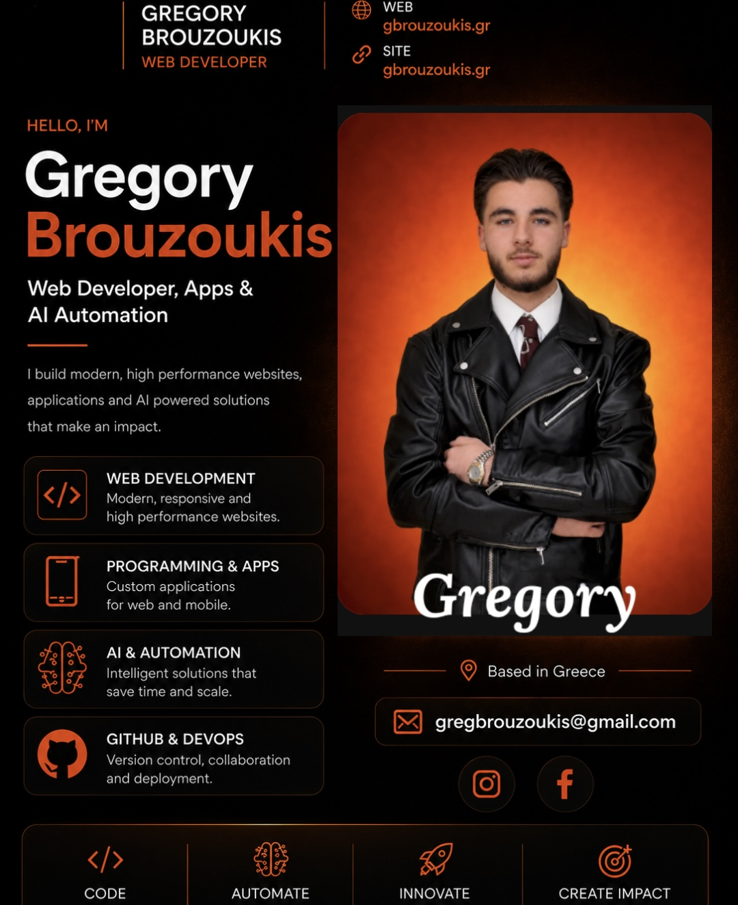

# Gregory Brouzoukis Portfolio Website

This repository documents my personal portfolio website, created to present my work, skills and progress in web development, programming, applications and AI automation.

Website: https://gbrouzoukis.gr

## About the project

This website was created as a personal professional profile and portfolio. Its purpose is to present who I am, what I am learning and what I am building in technology.

The site focuses mainly on programming, websites, applications and AI tools. It also works as a central place where someone can find my online presence, my projects and my technical progress.

## Main areas

1. Web development
2. Programming and applications
3. AI and automation
4. Personal projects
5. GitHub profile and technical work
6. Contact and professional information

## Tools used

1. WordPress
2. Elementor
3. Custom CSS
4. Hostinger hosting
5. Papaki domain management
6. Google Search Console
7. SEO and indexing tools
8. GitHub documentation

## Achievements

Gregory Brouzoukis won first place in the Algorithmics Christmas Contest 2026 with a Christmas themed programming project.

He has also taken part in MIT BWSI Open related learning activity and continues to build projects connected with programming, web development, applications and AI automation.

## Current status

The website is live and is being improved step by step. The main structure, design direction, legal pages, SEO setup and Google indexing work have already started.

The project is still active. More content, stronger project pages, screenshots and technical improvements will be added over time.

## Repository structure

1. docs contains website documentation, SEO notes, profile background and project planning
2. projects contains project pages and important work examples
3. CHANGELOG keeps track of updates and progress
4. assets can be used later for screenshots and preview images

## What this repository includes

This repository does not contain private WordPress files, hosting files, passwords, backups or database exports.

It includes documentation about the website, its structure, its design choices, its SEO setup, achievements and custom improvements.

## Goal

The goal of this project is to build a clean and professional online presence that can support my future work in programming, web development and technology.

## Creator

Gregory Brouzoukis
